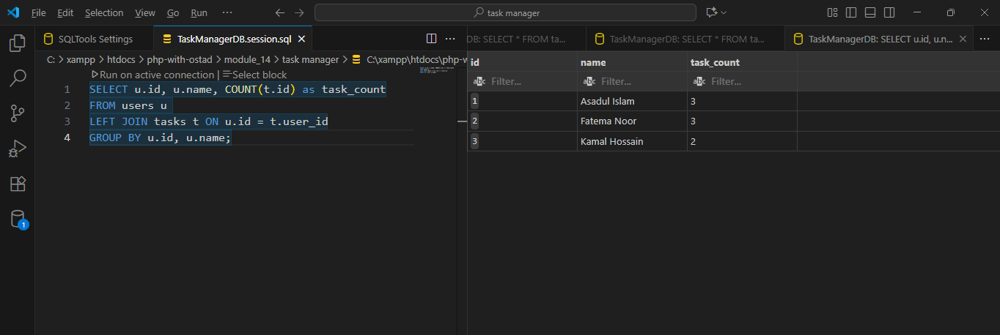

# Task Manager Database Assignment

## Database Name
task_manager
<!-- 
    CREATE DATABASE IF NOT EXISTS task_manager
    DEFAULT CHARACTER SET utf8mb4
    DEFAULT COLLATE  utf8mb4_unicode_ci;
    USE task_manager;
 -->

## Tables
1. users
   - id, name, email, created_at
<!-- 
    CREATE TABLE users (
        id INT AUTO_INCREMENT PRIMARY KEY,
        name VARCHAR(100) NOT NULL,
        email VARCHAR(150) NOT NULL UNIQUE,
        created_at TIMESTAMP DEFAULT CURRENT_TIMESTAMP
    );
-->

2. tasks
   - id, user_id, title, description, status (0,1), created_at

<!-- 
    CREATE TABLE tasks(
        id INT AUTO_INCREMENT PRIMARY KEY,
        user_id INT NOT NULL,
        title VARCHAR(100) NOT NULL,
        description TEXT,
        status TINYINT NOT NULL DEFAULT 0,
        created_at TIMESTAMP NOT NULL DEFAULT CURRENT_TIMESTAMP,
        FOREIGN KEY (user_id) REFERENCES users(id) ON DELETE CASCADE
    )
-->

## Relationships
- users → tasks = 1:N
- tasks.user_id → users.id

## Insert Data into User Table
<!-- 
    INSERT INTO users (name, email) VALUES
    ('Asadul Islam', 'asad@mail.com'),
    ('Fatema Noor', 'fatema@mail.com'),
    ('Kamal Hossain', 'kamal@mail.com');
-->

## Insert Data into Task Table

<!-- 
    INSERT INTO tasks (user_id, title, description, status) VALUES
    (1, 'Database Bakcup', 'taking backup fo servers', 0),
    (1, 'Create Presentation', 'making slides', 1),
    (1, 'Project Research', 'Resouces Collection', 0),
    (2, 'Web Design', 'Checking Hompage', 0),
    (2, 'Code Review', 'Projcet Code Review', 1), 
    (3, 'Users Feedbacks', 'sending form link', 1),
    (3, 'Bug Fixing', 'maintaining Login bugs', 0),
    (3, 'Doqumantion', 'designing README File', 0);
-->

## Queries Executed

- SELECT all tasks
<!-- used: SELECT * FROM tasks -->

- UPDATE task status
<!-- used:
    UPDATE tasks
    SET status = 1 -- Done
    WHERE id = 1;
-->

- DELETE task
<!-- used:
    DELETE FROM tasks
    WHERE id = 8;
 -->

- ADD NEW TASK
<!-- 
    INSERT INTO tasks (user_id, title, description, status) VALUES
    (2, 'Customar Care', 'handle customers problem', 1);
-->

- Sorting and Pagination
- First 5 rows showing in DESC mode
<!-- used:
    SELECT * FROM tasks
    ORDER BY created_at DESC
    LIMIT 0, 5;
 -->

- First firve rows showing in ASC mode
<!-- used:
    SELECT * FROM tasks
    LIMIT 0, 5;
 -->

- Aggregation (COUNT)

- INNER JOIN
<!-- 
    SELECT u.name, t.title, t.status
    FROM users u
    INNER JOIN tasks t ON u.id = t.user_id;
 -->

- LEFT JOIN
<!-- 
    SELECT u.name, t.title, t.status
    FROM users u
    LEFT JOIN tasks t ON u.id = t.user_id;
-->

- RIGHT JOIN
<!-- 
    SELECT u.id, u.name, COUNT(t.id) as task_count
    FROM users u
    LEFT JOIN tasks t ON u.id = t.user_id
-->

## Sample Data
- 3 users
- 2–3 tasks per user

